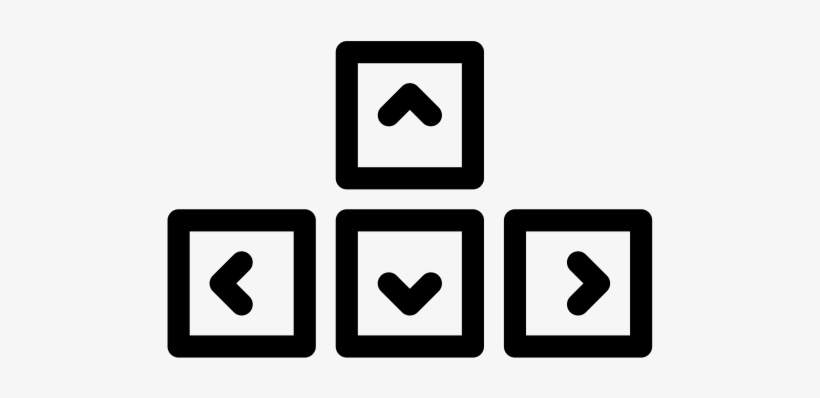
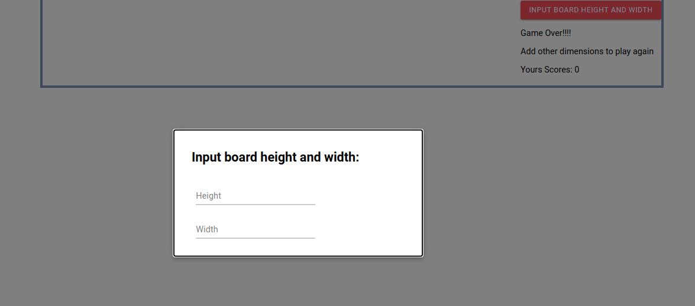
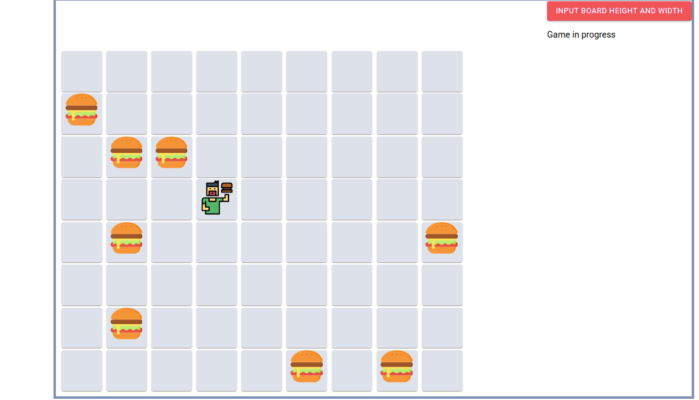

[![Contributor][contributor-shield]][contributor-url]
[![Issues][issues-shield]][issues-url]
<br />

<p align="center">
  <h1 align="center">Hamburger Maze </h1>
  <p align="center">
    React/Material-ui
    <br />
    <a href="https://github.com/bafiam/maze.git"><strong>Explore the docs »</strong></a>
    <br />
    <br />
    ·
    <a href="https://github.com/bafiam/maze/issues">Report Bug</a>
    ·
    <a href="https://github.com/bafiam/maze/issues">Request Feature</a>
  </p>
</p>

<!-- TABLE OF CONTENTS -->

## Table of Contents

- [About the Project](#about-the-project)
- [Screenshots](#screenshots)
- [Prerequisites Installations](#prerequisites-installations)
- [Technology used](#technology-used)
- [Usage/Getting Started](#how-to-Use)
- [Live Version](#live-version)
- [Roadmap](#roadmap)
- [License](#license)
- [Authors](#authors)

<!-- ABOUT THE PROJECT -->

## About The Project

This project is a Hamburger Maze App built with only React framework [using hooks]. It is a game that is intended for anyone who enjoys solving puzzles and gaming.

In this project, the complete feature of the app renders the following:

- Render the board in the number of squares given by the user
- Place your player roughly in the center of the board.
- Generate the Hamburger Sprites randomly on the board.
- Count the steps it takes for the player to eat all the Hamburger sprites on the board.

## Play

To play use the arrow keys.

- 

## Screenshots

#### Home



#### Play Board



## Prerequisites Installations

<p>If you want a copy of this project running on your machine you have to install:</p>

- <a href="https://nodejs.org/en/">Node.js (v5. 2.0 or greater)</a>
- <a href="https://git-scm.com/downloads">Git version control system</a>

## Technology used

- Node.js
- React
- Material-ui
- yarn
- CSS
- ES6
- Lodash

## Usage/Getting Started

Once you have installed the required package shown on the [Prerequisites Installations](#required-installations), proceed with the following steps

Clone the Repository,

```Shell
your@pc:~$ git clone https://github.com/bafiam/maze.git
```

Move into the cloned folder

```Shell
your@pc:~$ cd maze
```

Get the dependencies needed for the app

```Shell
your@pc:~$ yarn install
```

Start the server and use the app

```Shell
your@pc:~$ yarn start
```

## Live Version

This is the link to the live preview. Feel free to visit.<br>
[Hamburger Maze](https://serene-mestorf-79f912.netlify.app/)<br>

<!-- ROADMAP -->

## Roadmap

See the [open issues](https://github.com/bafiam/maze/issues) for a list of proposed features (and known issues).

<!-- CONTACT -->

## Authors

Stephen Gumba

- [GitHub profile](https://github.com/bafiam)

<!-- MARKDOWN LINKS & IMAGES -->
<!-- https://www.markdownguide.org/basic-syntax/#reference-style-links -->

[contributor-shield]: https://img.shields.io/badge/Contributors-1-%2300ff00
[contributor-url]: https://github.com/bafiam/maze/graphs/contributors
[issues-shield]: https://img.shields.io/badge/issues-0-%2300ff00
[issues-url]: https://github.com/bafiam/maze/issues/
